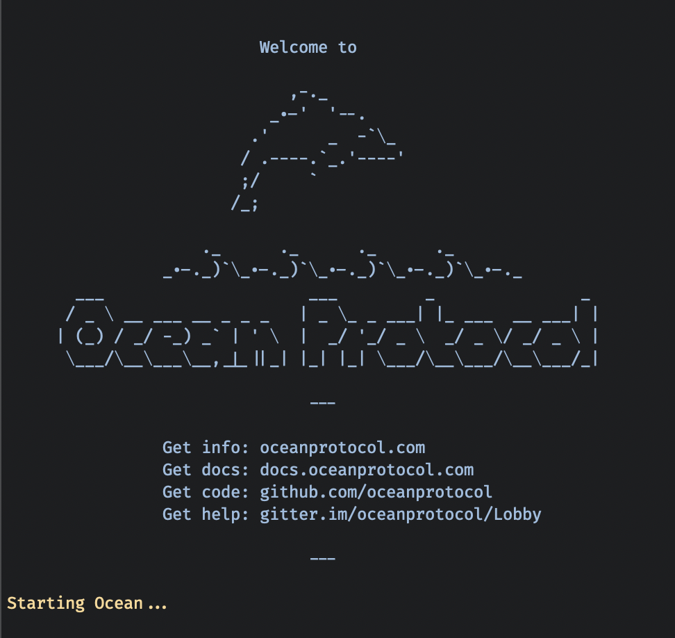

## Option 1

You can [try some free, online Jupyter notebooks](/tutorials/jupyter-notebooks/) that connect to a live Ocean test network.

## Option 2

**WARNING: This option is more for developers who don't mind some things not working together as expected (if at all). Eventually there will be a default-working version, but that doesn't exist yet.**

You can run and try every [Ocean software component](/concepts/components/) in your local machine, all at once, using Docker Compose. Ocean Protocol software developers do this often, to test their code against all the other Ocean components.

```bash
git clone https://github.com/oceanprotocol/barge.git
cd barge/
./start_ocean.sh --latest
```

Seeing the dolphin means it's working:



Once everything is up and running, you can interact with the components. For example, to interact with Pleuston, go to:

[http://localhost:3000/](http://localhost:3000/)

For the details of what components are running, see the [Ocean Protocol barge repository](https://github.com/oceanprotocol/barge).

<repo name="barge"></repo>
