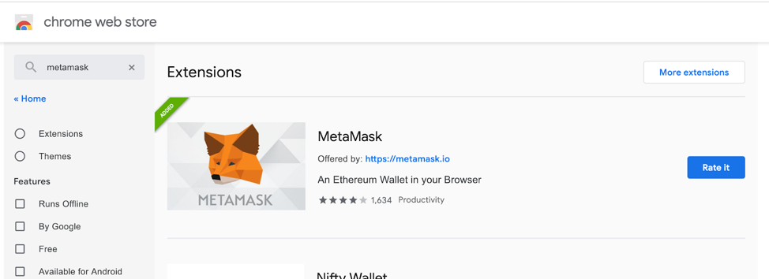
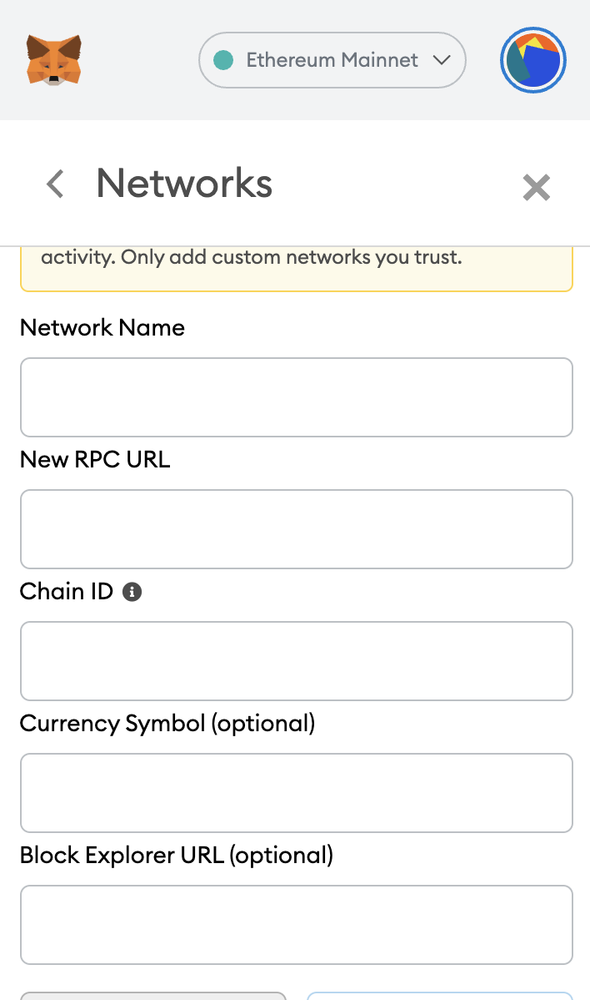

> MetaMask can also be used with a TREZOR or Ledger hardware wallet but we don't cover those options below; see [the MetaMask documentation](https://metamask.zendesk.com/hc/en-us/articles/360020394612-How-to-connect-a-Trezor-or-Ledger-Hardware-Wallet).

## MetaMask Set Up Steps

1. Go to the [Chrome Web Store for extensions](https://chrome.google.com/webstore/category/extensions) and search for MetaMask.

   

2. Install MetaMask. It will get added as a browser extension in the top right corner of your browser. Read through and accept the terms and conditions. Create a username and password in the next step.

   

3. MetaMask will generate a secret backup phrase for you. Write it down, store it in a safe place, and click next.

   

4. Confirm your secret backup phrase and finish your MetaMask wallet setup.

   

5. Voila! Your account is now created. You can now manage Ether and Ocean Tokens with your wallet. You can copy your account address to clipboard from the options. When you want someone to send Ether or Ocean Tokens to you, you will have to give them that address. It's not a secret.

You can also watch our [tutorial video snippets](https://www.youtube.com/playlist?list=PL_dn0wVs9kWolBCbtHaFxsi408cumOeth) if you want more help setting up MetaMask.

## Set Up Custom Network

Sometimes it is required to use custom or external networks in MetaMask. We can add a new one through MetaMask's Settings. 

Open the Settings menu and find the `Networks` option. When you open it, you'll be able to see all available networks your MetaMask wallet currently use. Click the `Add Network` button. 

There are a few empty inputs we need to fill:

- **Network Name:** this is the name that MetaMask is going to use to differentiate your network from the rest.
- **New RPC URL:** to operate with a network we need an endpoint (RPC). This can be a public or private URL.
- **Chain Id:** each chain has an Id
- **Currency Symbol:** it's the currency symbol MetaMask uses for your network
- **Block Explorer URL:** MetaMask uses this to provide a direct link to the network block explorer when a new transaction happens

When all the inputs are filled just click `Save`. MetaMask will automatically switch to the new network.
