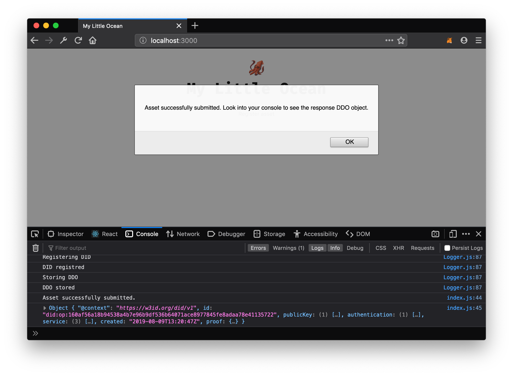

## Requirements

This is a continuation of the React App Tutorial. Make sure you already did the [React App Setup](/tutorials/react-setup/) and the [Publish a Data Set](/tutorials/react-publish-data-set/) steps.

Open `src/App.js` in your marketplace app.

## Retrieve Assets

In the previous tutorial we added asset publishing. We can now search for published assets for consumption. Just after the `submitAsset()` function we can add a new function that will handle search:

```js
// src/App.js
async retrieveAssets() {
  this.dbAssets = await this.ocean.assets.search("10 Monkey Species Small")
  console.log(this.dbAssets)
}
```

Now we need a button to start our search inside the render function just after `<button onClick={() => this.submitAsset()}>Register asset</button>`:

```jsx
// src/App.js
<button onClick={() => this.retrieveAssets()}>Retrieve assets</button>
```

## Consume Assets

Consuming means downloading one or multiple files attached to an asset. During that process the initial `url` value we added during the publish process for each file will be decrpyted and the file can be downloaded.

With the following code we start the consume process with the first search result, then go on to download its first attached file. Put it after the `retrieveAssets()` function:

```js
// src/App.js
async consumeAsset() {
  // get all accounts
  const accounts = await this.ocean.accounts.list()
  // get first asset
  const consumeAsset = this.dbAssets[0]
  // get service we want to execute
  const service = consumeAsset.findServiceByType('Access')
  // order service agreement
  const agreement = await this.ocean.assets.order(
      consumeAsset.id,
      service.serviceDefinitionId,
      accounts[0]
  )
  // consume it
  await this.ocean.assets.consume(
      agreement,
      consumeAsset.id,
      service.serviceDefinitionId,
      accounts[0],
      '',
      0
  )
}
```

We still need a button to start consumption. In the render function, just after the `<button onClick={()=>this.retrieveAssets()}>Retrieve assets</button>` line, add:

```jsx
// src/App.js
<button onClick={() => this.consumeAsset()}>Consume asset</button>
```

With all these buttons in place, you should see this:



Tip: Before clicking the `Retrieve assets` button, it might help to reload the page.

Go ahead and click the `Retrieve assets` button, and then the `Consume asset` button. Approve all the MetaMask dialog boxes.

Have a look into `console.log` to see the various steps of the search and consume process. If you have no errors in your `console.log` and can see your asset files listed, you have a working marketplace.

## Final Result

Here is the full source of `src/App.js` that you should have if you followed this tutorial:

```jsx
// src/App.js
import React, { Component } from 'react'
import './App.css'
import { Ocean } from '@oceanprotocol/squid'
import * as Web3 from 'web3'
import asset from './asset'

const web3 = new Web3(window.web3.currentProvider)
window.ethereum.enable()

class App extends Component {
  async componentDidMount() {
    this.ocean = await new Ocean.getInstance({
      web3Provider: web3,
      nodeUri: 'http://localhost:8545',
      aquariusUri: 'http://localhost:5000',
      brizoUri: 'http://localhost:8030',
      brizoAddress: '0x00bd138abd70e2f00903268f3db08f2d25677c9e',
      parityUri: 'http://localhost:8545',
      secretStoreUri: 'http://localhost:12001'
    })
    console.log('Finished loading contracts.')
  }

  async submitAsset() {
    const accounts = await this.ocean.accounts.list()
    const ddo = await this.ocean.assets.create(asset, accounts[0])
    console.log('Asset successfully submitted.')
    console.log(ddo)
    alert(
      'Asset successfully submitted. Look into your console to see the response DDO object.'
    )
  }

  async retrieveAssets() {
    this.dbAssets = await this.ocean.assets.search('10 Monkey Species Small')
    console.log(this.dbAssets)
    alert(
      'Asset successfully retrieved. Look into your console to see the search response.'
    )
  }

  async consumeAsset() {
    // get all accounts
    const accounts = await this.ocean.accounts.list()
    // get first asset
    const consumeAsset = this.dbAssets[0]
    // get service we want to execute
    const service = consumeAsset.findServiceByType('Access')
    // order service agreement
    const agreement = await this.ocean.assets.order(
      consumeAsset.id,
      service.serviceDefinitionId,
      accounts[0]
    )
    // consume it
    await this.ocean.assets.consume(
      agreement,
      consumeAsset.id,
      service.serviceDefinitionId,
      accounts[0],
      '',
      0
    )
  }

  render() {
    return (
      <div className="App App-header">
        <h1>Marketplace app</h1>
        <button onClick={() => this.submitAsset()}>Register asset</button>
        <hr />
        <button onClick={() => this.retrieveAssets()}>Retrieve assets</button>
        <button onClick={() => this.consumeAsset()}>Consume asset</button>
      </div>
    )
  }
}

export default App
```
