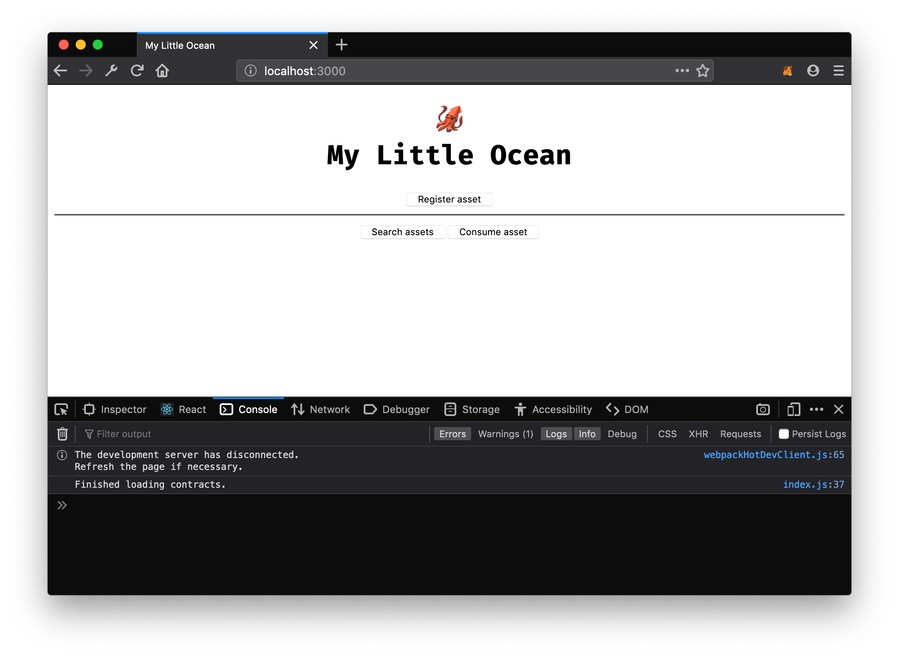

## Requirements

This is a continuation of the React App Tutorial. Make sure you already did the previous steps:

1. [React App Setup](/tutorials/react-setup/)
2. [Publish a Data Set](/tutorials/react-publish-data-set/)

Open `src/index.js` from your `marketplace/` folder.

## Search Assets

In the previous tutorial we added asset publishing. We can now search for published assets for consumption.

We will store the search results in the local component state so we have to set its initial state first:

GITHUB-EMBED https://github.com/oceanprotocol/react-tutorial/blob/e639e9ed4432e8b72ca453d50ed7bdaa36f1efb4/src/index.js jsx 15-19 GITHUB-EMBED

Just after the `registerAsset()` function we add a new `searchAssets` function that will handle search:

GITHUB-EMBED https://github.com/oceanprotocol/react-tutorial/blob/2765a7e6ae9a948d311d3949636cf832d2664900/src/index.js jsx 54-67 GITHUB-EMBED

Now we need a button to start our search inside the `render()` function, just after the _Register asset_ button:

GITHUB-EMBED https://github.com/oceanprotocol/react-tutorial/blob/2765a7e6ae9a948d311d3949636cf832d2664900/src/index.js jsx 115 GITHUB-EMBED

## Consume Asset

Consuming means downloading one or multiple files attached to an asset. During that process the initial `url` value we added during the publish process for each file will be decrpyted and the file can be downloaded.

With the following code we start the consume process with the first search result, then go on to download its first attached file. Put it after the `searchAssets()` function:

GITHUB-EMBED https://github.com/oceanprotocol/react-tutorial/blob/107d1fa7d0c583cc8042339f1f5090ff9ee0920b/src/index.js jsx 73-95 GITHUB-EMBED

We still need a button to start consumption. In the render function, just after the _Search assets_ button, add:

GITHUB-EMBED https://github.com/oceanprotocol/react-tutorial/blob/2765a7e6ae9a948d311d3949636cf832d2664900/src/index.js jsx 116-118 GITHUB-EMBED

With all these buttons in place, you should see this:

Go ahead and click the _Search assets_ button, and then the _Consume asset_ button. Approve all the MetaMask dialog boxes.

Have a look into `console.log` to see the various steps of the search and consume process. If you have no errors in your `console.log` and can see your asset files listed, you have a working marketplace.

## Final Result

Here is the full source of `src/index.js` that you should have if you followed this tutorial:

GITHUB-EMBED https://github.com/oceanprotocol/react-tutorial/blob/master/src/index.js jsx GITHUB-EMBED

## Git repository and CodeSandbox

All code snippets in this tutorial are sourced from the [oceanprotocol/react-tutorial](https://github.com/oceanprotocol/react-tutorial) GitHub repository:

<repo name="react-tutorial"></repo>

The final source of this tutorial is also available as a CodeSandbox:

