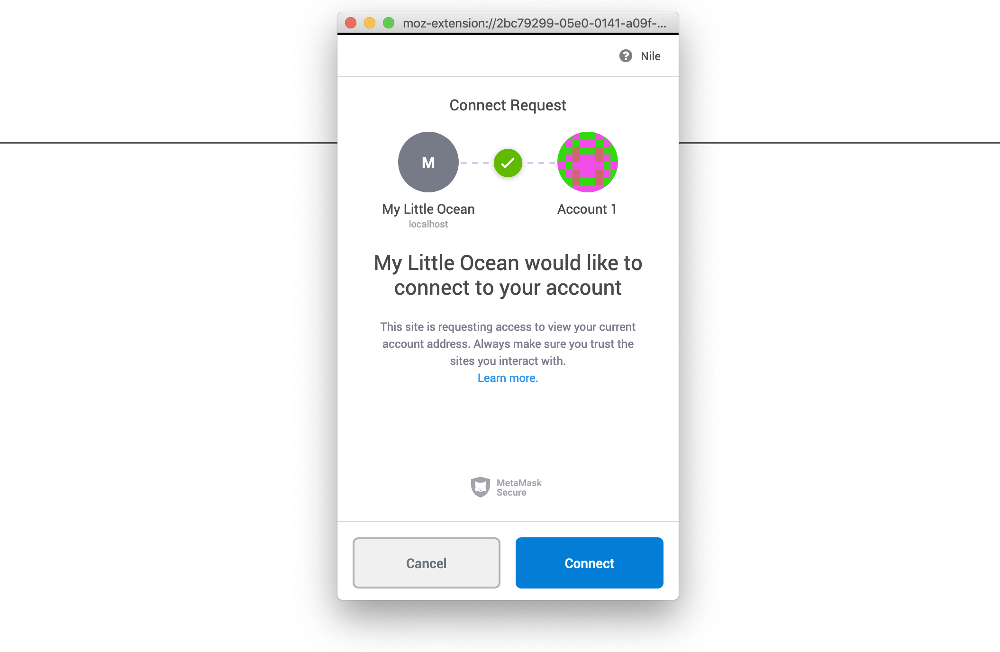

## Git repository and CodeSandbox

All code snippets in this tutorial are sourced from the [oceanprotocol/react-tutorial](https://github.com/oceanprotocol/react-tutorial) GitHub repository:

<repo name="react-tutorial"></repo>

The final source of this tutorial is also available as a CodeSandbox:

[](https://codesandbox.io/s/github/oceanprotocol/react-tutorial/tree/master/?fontsize=14)

## Requirements

- `Node.js` >= 10 is installed. You can check using `node -v`
- `npm` >= 5.2 is installed. You can check using `npm -v`
- [Docker](https://www.docker.com/products/docker-desktop) & [Docker Compose](https://docs.docker.com/compose/install/)
- A Web3 capable browser, like Firefox/Chrome with [MetaMask](https://metamask.io) installed, [connected to Nile network](http://localhost:8000/tutorials/connect-to-networks/#connect-to-the-nile-testnet)
- Some Nile ETH from the Nile Faucet. You can either go to [commons.nile.dev-ocean.com/faucet](https://commons.nile.dev-ocean.com/faucet), or execute this command replacing `<YOUR ADDRESS>` with your MetaMask account address:

  ```bash
  curl --data '{"address": "<YOUR ADDRESS>", "agent": "curl"}' -H "Content-Type: application/json" -X POST https://faucet.nile.dev-ocean.com/faucet
  ```

## New Create React App

We are going to use Create React App to bootstrap our React app. You could use `npx create-react-app marketplace` but it creates more files than needed for the scope of this tutorial.

So let's go minimal and build up our app from scratch with this structure:

```text
marketplace/
├── package.json
├── public/
├──── index.html
├── src/
├──── index.js
```

First, create a new project folder for your new app, e.g. `marketplace`. Within that, add a new file `package.json` with the following content:

GITHUB-EMBED https://github.com/oceanprotocol/react-tutorial/blob/2765a7e6ae9a948d311d3949636cf832d2664900/package.json json GITHUB-EMBED

Notice the `@oceanprotocol/squid` dependency, which is the [Ocean Protocol JavaScript library](https://github.com/oceanprotocol/squid-js). Save that file, and in your terminal install the dependencies we have just defined in `package.json`:

```bash
npm install
```

Then create the HTML file used to render the React app into. For that, create a folder `public/` and in it a file `index.html` with the following content:

GITHUB-EMBED https://github.com/oceanprotocol/react-tutorial/blob/2765a7e6ae9a948d311d3949636cf832d2664900/public/index.html html GITHUB-EMBED

## Add Basic Markup

Create a new folder `src/` and within that a `index.js` file with the following content as our base, where we already import squid-js and web3.js:

GITHUB-EMBED https://github.com/oceanprotocol/react-tutorial/blob/2765a7e6ae9a948d311d3949636cf832d2664900/src/index.js js 1-4,6,14,97-108,119-124 GITHUB-EMBED

At this point you can start up the app and see the result in your browser:

```bash
npm start
```

Go to [localhost:3000](http://localhost:3000) to inspect your newly created app:


## Web3

We already are importing web3.js but we still need to enable account access for the browsers supporting it, and make sure nothing breaks in browsers which are not Web3-capable.

To do that we add a simple check at top of `src/index.js` and then enable account access with:

GITHUB-EMBED https://github.com/oceanprotocol/react-tutorial/blob/2765a7e6ae9a948d311d3949636cf832d2664900/src/index.js js 7-12 GITHUB-EMBED

And let's also output some warning for non-Web3 browsers within our `render()` function:

GITHUB-EMBED https://github.com/oceanprotocol/react-tutorial/blob/2765a7e6ae9a948d311d3949636cf832d2664900/src/index.js js 109 GITHUB-EMBED

This should give you the following markup:

GITHUB-EMBED https://github.com/oceanprotocol/react-tutorial/blob/2765a7e6ae9a948d311d3949636cf832d2664900/src/index.js js 1-4,6-14,97-109,119-124 GITHUB-EMBED

After those steps go to your browser. You should see MetaMask asking you to allow access to your account:



> Note: If you see an error like `inpage.js:1 MetaMask - RPC Error: Internal JSON-RPC error.` in your browser console, don't worry about it. It's a MetaMask thing and won't affect functionality.

## Create Ocean Instance

Now that we are successfully connected with Web3, we can set up our Ocean instance.

At the beginning of your component, create a new Ocean instance with all required endpoint configurations within the `componentDidMount` lifecycle method. All Ocean Protocol operations can be executed from this Ocean instance.

GITHUB-EMBED https://github.com/oceanprotocol/react-tutorial/blob/2765a7e6ae9a948d311d3949636cf832d2664900/src/index.js js 15-16,18-27,34-38 GITHUB-EMBED

This will initiate a connection to all Ocean components in Nile, load the contracts, and finally store the Ocean object in the local component state for reuse.

We also set the `verbose` option of squid-js so we better see what's going on.

## Final Result

That's it, if you have no errors in your `console.log` then you have successfully initialized an Ocean instance in your brand new React app and you are ready for the [next part of this tutorial](/tutorials/react-publish-data-set/).


Here is the full source of `src/index.js` that you should have if you followed this tutorial:

GITHUB-EMBED https://github.com/oceanprotocol/react-tutorial/blob/2765a7e6ae9a948d311d3949636cf832d2664900/src/index.js js 1-4,6-16,18-27,34-38,96-109,119-124 GITHUB-EMBED

**Move on to [Publish a Data Set](/tutorials/react-publish-data-set/).**

## Bonus: Connect against local Spree network

[_Spree_](https://docs.oceanprotocol.com/concepts/testnets/#a-spree-testnet-for-local-development), a local Ocean test network, can be used instead of remotely connecting to Nile. For this you first have to get up the Spree network by using [oceanprotocol/barge](https://github.com/oceanprotocol/barge).

Clone the barge repository and use its startup script:

```bash
git clone https://github.com/oceanprotocol/barge.git
cd barge/

./start_ocean.sh --no-pleuston
```

Note that compiling and deploying the contracts in your local Docker network takes some time so it can take a few minutes until the network is ready to be interacted with. That usually is the case once `keeper-contracts_1` container doesn't show any messages anymore.

At the end of the contract compiling and deploying you need to copy the resulting _Spree_ contract artifacts from the Docker container to your local `@oceanprotocol/keeper-contracts` dependency folder. The _keeper-contracts_ Docker container will output all artifacts in a hidden folder in your home folder so you can copy from there:

```bash
cp ~/.ocean/keeper-contracts/artifacts/* ./node_modules/@oceanprotocol/keeper-contracts/artifacts/
```

You will also need some [_Spree_ Ether](/tutorials/get-ether-and-ocean-tokens/#get-ether-for-a-local-spree-testnet) in your MetaMask account. You can execute this, replacing `<YOUR ADDRESS>` with your MetaMask account address:

```bash
curl --data '{"address": "<YOUR ADDRESS>", "agent": "curl"}' -H "Content-Type: application/json" -X POST http://localhost:3001/faucet
```

Finally, move back to your marketplace React app and modify the Ocean instance config in `src/index.js` to use the Spree endpoints:

```js
const ocean = await new Ocean.getInstance({
  web3Provider: web3,
  nodeUri: 'http://localhost:8545',
  aquariusUri: 'http://aquarius:5000',
  brizoUri: 'http://localhost:8030',
  brizoAddress: '0x00bd138abd70e2f00903268f3db08f2d25677c9e',
  secretStoreUri: 'http://localhost:12001',
  verbose: true
})
```

Then start up the app as usual:

```bash
npm start
```
