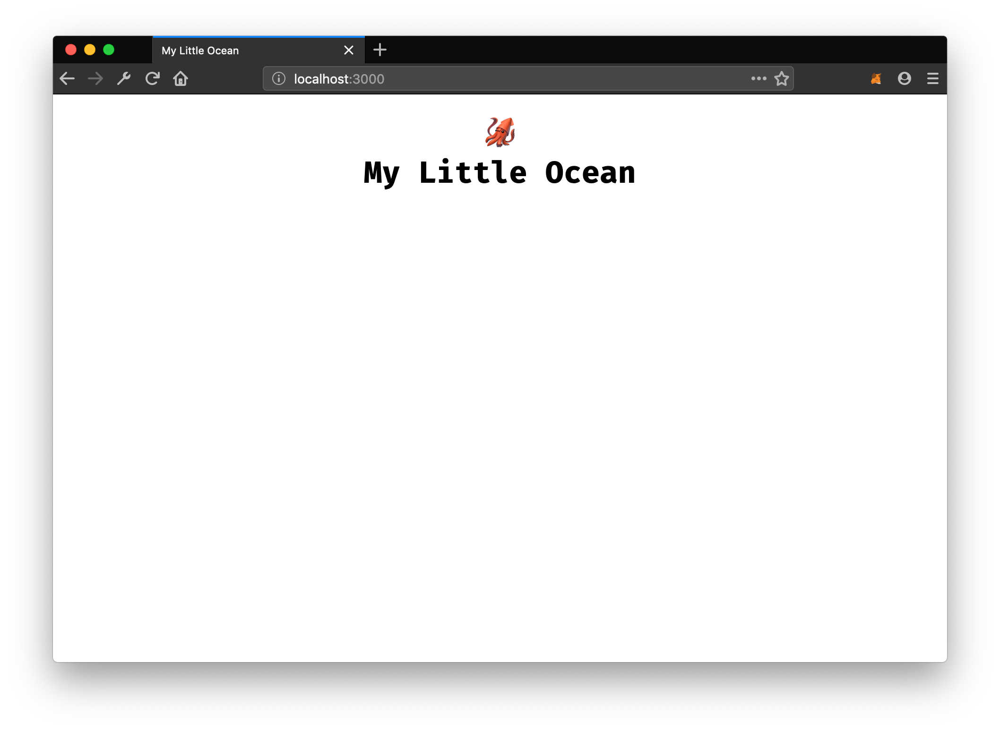

## Git repository and CodeSandbox

All code snippets in this tutorial are sourced from the [oceanprotocol/react-tutorial](https://github.com/oceanprotocol/react-tutorial) GitHub repository:

<repo name="react-tutorial"></repo>

The final source of this tutorial is also available as a CodeSandbox:

[](https://codesandbox.io/s/github/oceanprotocol/react-tutorial/tree/master/?fontsize=14)

## Requirements

- `Node.js` >= 10 is installed. You can check using `node -v`
- `npm` >= 5.2 is installed. You can check using `npm -v`
- A Web3 capable browser, like Firefox/Chrome with [MetaMask](https://metamask.io) installed, [connected to Nile network](https://docs.oceanprotocol.com/tutorials/connect-to-networks/#connect-to-the-nile-testnet)
- Some Nile ETH from the Nile Faucet. You can either go to [commons.nile.dev-ocean.com/faucet](https://commons.nile.dev-ocean.com/faucet), or execute this command replacing `<YOUR ADDRESS>` with your MetaMask account address:

  ```bash
  curl --data '{"address": "<YOUR ADDRESS>", "agent": "curl"}' -H "Content-Type: application/json" -X POST https://faucet.nile.dev-ocean.com/faucet
  ```

## New Create React App

We are going to use Create React App to bootstrap our React app. You could use `npx create-react-app marketplace` but it creates more files than needed for the scope of this tutorial.

So let's go minimal and build up our app from scratch with this structure:

```text
marketplace/
├── package.json
├── public/
├──── index.html
├── src/
├──── index.js
```

First, create a new project folder for your new app, e.g. `marketplace`. Within that, add a new file `package.json` with the following content:

GITHUB-EMBED https://github.com/oceanprotocol/react-tutorial/blob/master/package.json json GITHUB-EMBED

Notice the `@oceanprotocol/ocean.js` dependency, which is the [Ocean Protocol JavaScript library](https://github.com/oceanprotocol/ocean.js). Save that file, and in your terminal install the dependencies we have just defined in `package.json`:

```bash
npm install
```

Then create the HTML file used to render the React app into. For that, create a folder `public/` and in it a file `index.html` with the following content:

GITHUB-EMBED https://github.com/oceanprotocol/react-tutorial/blob/master/public/index.html html GITHUB-EMBED

## Add Basic Markup

Create a new folder `src/` and within that a `index.js` file with the following content as our base, where we already import ocean.js and web3.js:

GITHUB-EMBED https://github.com/oceanprotocol/react-tutorial/blob/e639e9ed4432e8b72ca453d50ed7bdaa36f1efb4/src/index.js jsx 1-4,6,14,100-110,122-127 GITHUB-EMBED

At this point you can start up the app and see the result in your browser:

```bash
npm start
```

Go to [localhost:3000](http://localhost:3000) to inspect your newly created app:



## Setup Web3

We already are importing web3.js but we still need to enable account access for the browsers supporting it, and make sure nothing breaks in browsers which are not Web3-capable.

To do that we add a simple check at top of `src/index.js` and then enable account access with:

GITHUB-EMBED https://github.com/oceanprotocol/react-tutorial/blob/e639e9ed4432e8b72ca453d50ed7bdaa36f1efb4/src/index.js jsx 7-12 GITHUB-EMBED

And let's also output some warning for non-Web3 browsers within our `render()` function:

GITHUB-EMBED https://github.com/oceanprotocol/react-tutorial/blob/e639e9ed4432e8b72ca453d50ed7bdaa36f1efb4/src/index.js jsx 112 GITHUB-EMBED

This should give you the following markup:

GITHUB-EMBED https://github.com/oceanprotocol/react-tutorial/blob/e639e9ed4432e8b72ca453d50ed7bdaa36f1efb4/src/index.js jsx 1-4,6-14,100-112,122-127 GITHUB-EMBED

After those steps go to your browser. You should see MetaMask asking you to allow access to your account:


> Note: If you see an error like `inpage.js:1 MetaMask - RPC Error: Internal JSON-RPC error.` in your browser console, don't worry about it. It's a MetaMask thing and won't affect functionality.

## Create Ocean Instance

Now that we are successfully connected with Web3, we can set up our Ocean instance.

At the beginning of your component, create a new Ocean instance with all required endpoint configurations within the `componentDidMount` lifecycle method. All Ocean Protocol operations can be executed from this Ocean instance.

GITHUB-EMBED https://github.com/oceanprotocol/react-tutorial/blob/e639e9ed4432e8b72ca453d50ed7bdaa36f1efb4/src/index.js jsx 15-16,19-28,35-39 GITHUB-EMBED

This will initiate a connection to all Ocean components in Nile, load the contracts, and finally store the Ocean object in the local component state for reuse.

We also set the `verbose` option of ocean.js so we better see what's going on.

## Final Result

That's it, if you have no errors in your `console.log` then you have successfully initialized an Ocean instance in your brand new React app and you are ready for the [next part of this tutorial](/tutorials/react-publish-data-set/).


Here is the full source of `src/index.js` that you should have if you followed this tutorial:

GITHUB-EMBED https://github.com/oceanprotocol/react-tutorial/blob/2765a7e6ae9a948d311d3949636cf832d2664900/src/index.js jsx 1-4,6-16,18-27,34-38,96-109,119-124 GITHUB-EMBED

**Move on to [Publish a Data Set](/tutorials/react-publish-data-set/).**

## Bonus: Connect against local network

Instead of remotely connecting to Rinkeby, you can connect to your own [local network](concepts/network-local). It uses Ethereum Ganache plus Ocean Barge. 

```bash
git clone https://github.com/oceanprotocol/barge.git
cd barge/

./start_ocean.sh --no-commons
```

Compiling and deploying the contracts in your local network may take a few minutes.

### Copy Contract Artifacts

At the end of the contract compiling and deploying you need to copy the resulting contract artifacts from the Docker container to your local `@oceanprotocol/keeper-contracts` dependency folder. The _keeper-contracts_ Docker container will output all artifacts in a hidden folder in your home folder so you can copy from there:

```bash
cp ~/.ocean/keeper-contracts/artifacts/* ./node_modules/@oceanprotocol/keeper-contracts/artifacts/
```

### Get ETH for the local network

You will also need some ETH for your local network. [This tutorial](/tutorials/get-ETH-and-OCEAN-tokens) describes how to get it into your MetaMask account.

You can execute this, replacing `<YOUR ADDRESS>` with your MetaMask account address:

```bash
curl --data '{"address": "<YOUR ADDRESS>", "agent": "curl"}' -H "Content-Type: application/json" -X POST http://localhost:3001/faucet
```

### Adjust App Config

Finally, move back to your marketplace React app and modify the Ocean instance config in `src/index.js` to use the local network's endpoints:

```jsx
const ocean = await new Ocean.getInstance({
  web3Provider: web3,
  nodeUri: 'http://localhost:8545',
  aquariusUri: 'http://aquarius:5000',
  brizoUri: 'http://localhost:8030',
  brizoAddress: '0x00bd138abd70e2f00903268f3db08f2d25677c9e',
  secretStoreUri: 'http://localhost:12001',
  verbose: true
})
```

> If you are on macOS, you need to additionally tweak your `/etc/hosts` file so Brizo can connect to Aquarius within Docker. This is only required on macOS and is a [known limitation of Docker for Mac](https://docs.docker.com/docker-for-mac/networking/#known-limitations-use-cases-and-workarounds):
>
> ```bash
> sudo vi /etc/hosts
>
> # add this line, and save
> 127.0.0.1    aquarius
> ```
>
> And then use `aquariusUri: 'http://aquarius:5000'` in your Ocean instance config.

Then start up the app as usual:

```bash
npm start
```

**Move on to [Publish a Data Set](/tutorials/react-publish-data-set/).**
